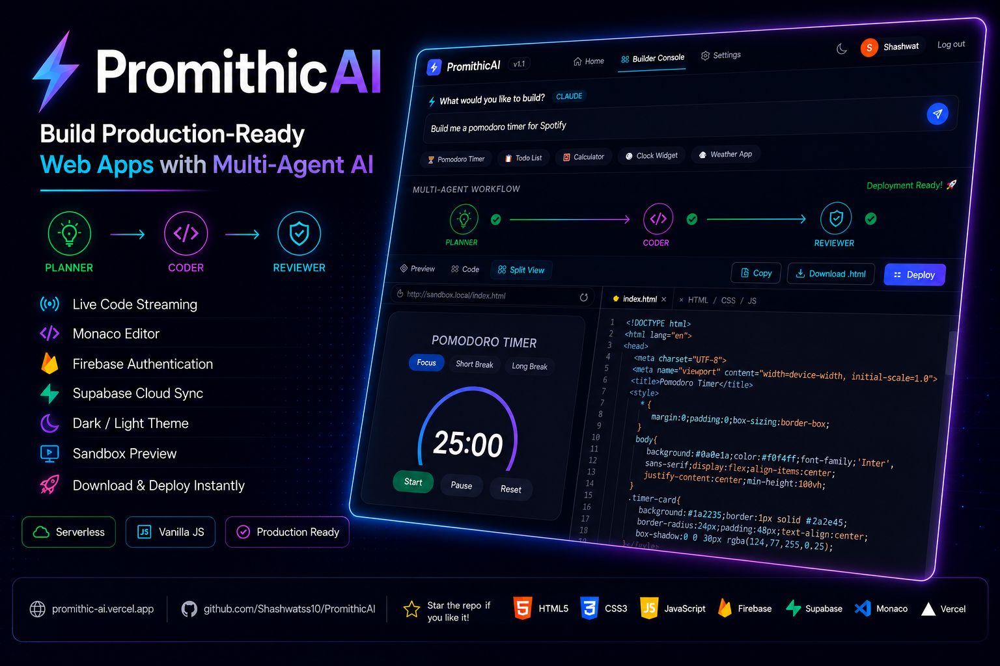
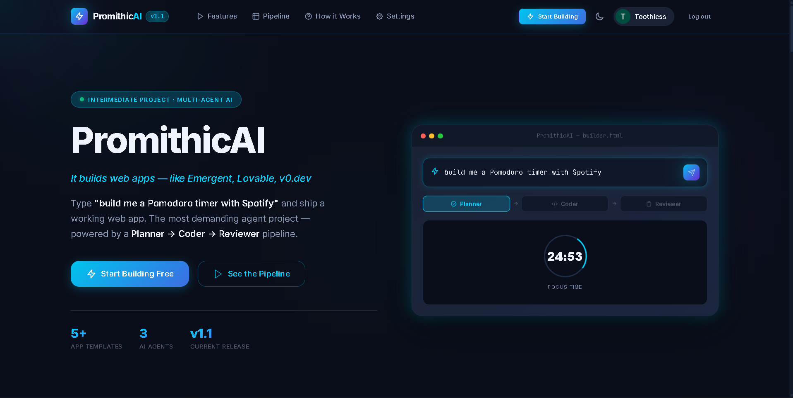
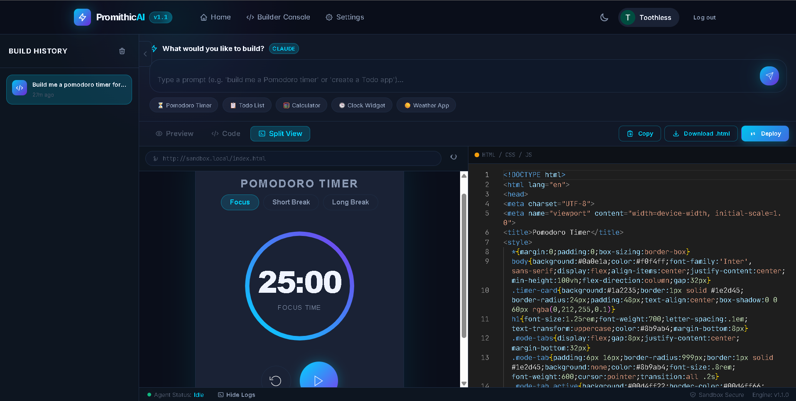
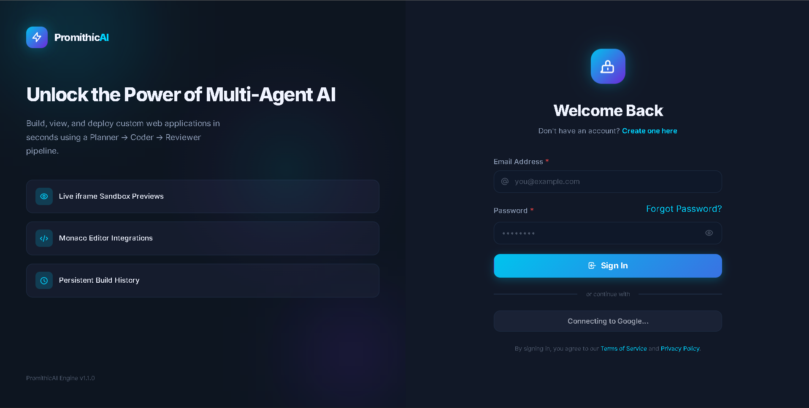
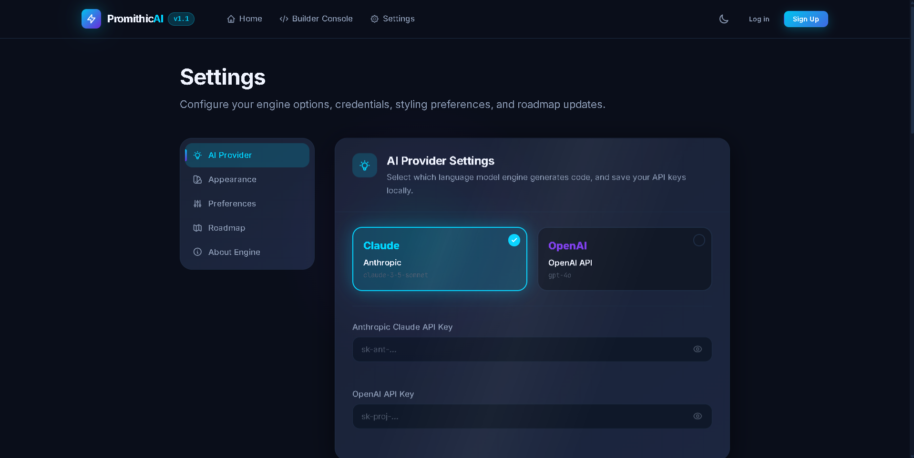

# ⚡ PromithicAI

<p align="center">
  
</p>

<p align="center">


</p>

<p align="center">
AI-Powered Web Application Builder inspired by modern AI development platforms.
</p>

<p align="center">
Planner → Coder → Reviewer
</p>

<p align="center">
<a href="https://promithic-ai.vercel.app">🌐 Try PromithicAI</a> •
<a href="https://github.com/Shashwatss10/PromithicAI">⭐ GitHub</a>
</p>

---

## ✨ Features

| Feature | Description |
|---------|-------------|
| 🤖 Multi-Agent Workflow | Planner → Coder → Reviewer pipeline |
| ⚡ Live Code Streaming | Real-time AI generation simulation |
| 💻 Monaco Editor | VS Code-like editing experience |
| 🔥 Firebase Authentication | Email & Google Sign-in |
| ☁️ Supabase Sync | Cross-device project history |
| 🌙 Dark / Light Theme | Persistent theme switching |
| 🧩 Live Sandbox Preview | Execute generated apps safely |
| 📥 HTML Export | Download production-ready HTML |
| 🚀 One-click Deployment | Deploy generated applications |
| 📱 Responsive Design | Desktop & mobile optimized |

---

## 📷 Project Preview

### Landing Page



---

### Builder Console



---

### Authentication



---

### Settings



---

## 🛠 Tech Stack

| Category | Technologies |
|----------|--------------|
| **Frontend** | HTML5, CSS3, Vanilla JavaScript (ES6+) |
| **Editor** | Monaco Editor |
| **Authentication** | Firebase Authentication (Email/Password, Google OAuth) |
| **Database** | Supabase PostgreSQL (REST Client) |
| **Deployment** | Vercel, GitHub Pages |
| **Architecture** | Multi-Agent Workflow, Client-Side Rendering |
| **Styling** | CSS Variables, Flexbox, Grid, Glassmorphism |

<p align="center">

</p>

---

## 📂 Project Structure

```
PromithicAI/
├── assets/
│   └── banner.png                # Repository Banner
│
├── screenshots/
│   ├── landing.png
│   ├── builder.png
│   ├── login.png
│   └── settings.png
│
├── index.html          # Marketing / Landing Page
├── builder.html        # Main IDE Console Workspace
├── settings.html       # API Configuration & Engine State
├── login.html          # Firebase Authentication
├── signup.html         # User Onboarding & Signup
├── vercel.json         # Vercel Clean URL Redirects
├── README.md           # Project Specification
├── LICENSE             # MIT License
├── .gitignore          # Version Control Filters
│
├── css/                # Styling Architecture
│   ├── base.css
│   ├── variables.css   # Global Theme & Color Tokens
│   ├── animations.css  # Core Layout Transitions
│   ├── components.css
│   ├── landing.css
│   ├── auth.css
│   ├── settings.css
│   ├── builder.css
│   ├── brand-story.css # PromithicAI Brand Segment Styling
│   ├── fx.css          # Cursor spotlight, magnetic, and dynamic glows
│   └── polish.css      # v1.1 Micro-Interaction Polish (logo pulse, shimmers, active glows)
│
└── js/                 # Vanilla JS Logic Components
    ├── theme.js        # Light/Dark Mode Persistence
    ├── router.js       # Fade-In Client-Side Routing
    ├── firebase.js     # Firebase SDK Wrapper (Email/Password, Google OAuth)
    ├── supabase.js     # Supabase REST Client
    ├── auth.js         # Session Detection & Navbar Badge Render
    ├── editor.js       # Monaco Editor & Fallback API
    ├── streaming.js    # AI Token Output Simulation
    ├── history.js      # Hybrid Local/Supabase Persistence Sync
    ├── agent.js        # Multi-Agent Workflow Logic
    └── fx.js           # Intersection Observers & Mouse FX

> 📁 The project follows a modular architecture, separating UI, styling, business logic, authentication, and deployment configuration for better maintainability and scalability.
```

---

## 🏗 System Architecture

PromithicAI follows a client-side multi-agent workflow that transforms natural language prompts into production-ready web applications through planning, code generation, review, sandbox execution, and export.

```text
                                                       User Prompt
                                                            │
                                                            ▼
                                                      Planner Agent
                                                 (Requirement Analysis)
                                                            │
                                                            ▼
                                                       Coder Agent
                                               (HTML • CSS • JS Generation)
                                                            │
                                                            ▼
                                                      Reviewer Agent
                                                (Validation & Optimization)
                                                            │
                                                            ▼
                                                    Monaco Code Editor
                                                (Live Source Code Editing)
                                                            │
                                                            ▼
                                                     Sandbox Preview
                                                (Secure iframe Execution)
                                                            │
                                               ┌────────────┴────────────┐
                                               ▼                         ▼
                                         Download HTML           Deploy Application
```

### Authentication & Cloud Sync

```text
                                                         User
                                                           │
                                                           ▼
                                                 Firebase Authentication
                                                           │
                                                           ▼
                                                  Authenticated Session
                                                           │
                                                           ▼
                                                   Supabase Database
                                                           │
                                                           ▼
                                               Build History Synchronization
```

### Workflow Overview

1. **Planner Agent** analyzes the user's request.
2. **Coder Agent** generates HTML, CSS, and JavaScript.
3. **Reviewer Agent** validates and improves the generated code.
4. The generated code is loaded into the **Monaco Editor**.
5. A secure **Sandbox Preview** renders the application.
6. Users can download or deploy the generated application.

---

## 📖 About the Project

**PromithicAI** is a serverless, front-end-heavy development console. When a user input is received (e.g., *"Build me a Pomodoro timer"*), the system initiates a structured multi-agent loop:

```
[User Prompt] ──> 👤 Planner Agent ──> 👤 Coder Agent ──> 👤 Reviewer Agent ──> 🖥️ Sandbox Preview
```

The app features full code streaming, live sandboxed previews, theme toggles, and cloud-synced compilation history, making it both an educational workspace and a framework for AI agent developers.

---

## 🎯 What it Solves

1. **High-Fidelity AI Orchestration Visualization:** It demonstrates how complex multi-agent pipelines (Planner → Coder → Reviewer) communicate state and hand off tasks asynchronously.
2. **Zero-Setup Prototyping:** Allows developers and designers to test interactive widget layouts instantly, completely inside the browser.
3. **No-Dependency Code Editing:** Integrates the full VS Code Monaco editor directly via CDN, offering instant linting and syntax highlighting without massive `node_modules` configurations.
4. **Immediate Exportability:** Renders applications into sandboxed previews, providing single-click options to copy the clean HTML or download a production-ready `.html` file that runs offline.

---

## 🛠️ Technical Challenges & Problems Faced

Building a stateful agent system purely on the client-side using Vanilla JavaScript brought several complex implementation challenges:

*   **Concurrency & Stream Cancellation:**
    Handling stateful, asynchronous streaming loops inside the single-thread model of a browser meant that if a user canceled a build or submitted a new prompt mid-generation, overlapping text streams could corrupt the editor model. This was solved in `js/streaming.js` and `js/agent.js` by implementing cancelable promise wrappers and an explicit external abort polling system (`getAbort()`).
*   **Resilient Monaco CDN Integration:**
    Embedding a heavyweight code editor requires robust script loading. If the CDN load of Monaco fails (e.g., offline usage or blocked domains), the app's core feature breaks. To address this, `js/editor.js` implements a self-healing fallback mechanism that automatically constructs a lightweight, customized `textarea` replicating Monaco's editor interfaces (`getValue`, `setValue`, `appendCode`) to ensure zero-downtime operation.
*   **Secure Sandboxing of Generated Code:**
    Injecting arbitrary JavaScript and CSS from AI outputs into the parent page's DOM would corrupt global styles, leak local storage credentials, and trigger cross-site scripting conflicts. To ensure safe execution, generated apps are dynamically injected via the `srcdoc` property of an `<iframe>` configured with a strict `sandbox="allow-scripts"` directive, thereby completely isolating the generated workspace.
*   **Hybrid Storage Boundaries:**
    Managing local history (up to 30 past builds containing full source code and prompts) in local storage pushes the limits of the browser's standard 5MB limit. To support multi-device access and persistent storage, we implemented a hybrid cloud sync strategy: local builds write immediately to local storage and queue up for asynchronous replication to Supabase when a user signs in.
*   **Grid Layouts without UI Libraries:**
    Structuring an IDE-style interface (adjustable columns, sliding history drawers, terminal console logs, iframe previews, and modal popups) while maintaining a premium glassmorphic appearance required complex CSS variables and media query orchestration in `css/builder.css` and `css/components.css` without relying on Tailwind or Bootstrap.

---


## 🚀 Upgrades in v1.1 Release

- **Firebase Authentication Integration:** Integrated native authentication flows supporting traditional Email/Password credentials and Google OAuth Single-Sign-On (SSO) popup windows.
- **Supabase Cloud Sync DB:** Engineered a lightweight REST-based database synchronization protocol sending and loading builds directly using Supabase PostgreSQL databases, resolving the single-device 5MB local limits.
- **Visual Micro-Interaction Polish:** Created a comprehensive `polish.css` system including:
  - Gradient logo text transitions and pulsing glow mechanics on brand badges.
  - Non-intrusive sweeping light beams animating versioning stickers.
  - Interactive tactile key compression scales (`scale(0.97)`) on click/touch actions.
  - Staggered structural layout transitions for loaded sidebar history blocks.
  - Fluid error panel animations sliding down on authentication failure.
- **Brand Rebirth:** Cleaned all instances of "AI Web App Builder" and converted them to **PromithicAI**.

---

## 🔮 Upcoming Features (v1.2+)

| Version | Planned Feature | Status |
|:---|:---|:---|
| **v1.2** | Custom API Keys (Send queries directly using user key) | *Next Up* |
| **v2.0** | LangGraph Orchestration & Python FastAPI Backend | *Planned* |
| **v2.1** | MCP Sandboxed local execution capabilities | *Planned* |
| **v2.2** | Push to GitHub & deploy directly from the IDE | *Planned* |
| **v3.0** | Voice-to-App live streaming | *Planned* |

---

## ⚙️ Deployment Guide

### Step 1: Deploy to Vercel
1. Log in to [Vercel](https://vercel.com) using your GitHub account.
2. Select **"Import Project"** and choose the `PromithicAI` repository.
3. Keep the framework preset as **Other** and the root directory as `./`.
4. Click **Deploy**. Vercel will build the project using the static configuration in `vercel.json` for clean URL routing.

### Step 2: Configure Firebase Authentication
1. Go to the [Firebase Console](https://console.firebase.google.com/).
2. Select your project and navigate to **Authentication** -> **Settings**.
3. Under **Authorized domains**, click **"Add domain"** and add your Vercel deployment URL (e.g., `promithic-ai.vercel.app`).
4. Ensure **Email/Password** and **Google** are enabled under the **Sign-in method** tab.

### Step 3: Set up Supabase Database Schema
Run the following query in the **SQL Editor** of your Supabase dashboard to create the synced builds table:

```sql
CREATE TABLE IF NOT EXISTS public.builds (
  id          TEXT PRIMARY KEY,
  user_id     TEXT NOT NULL,
  prompt      TEXT NOT NULL,
  code        TEXT NOT NULL,
  template    TEXT DEFAULT 'custom',
  provider    TEXT DEFAULT 'claude',
  created_at  TIMESTAMPTZ DEFAULT NOW()
);
CREATE INDEX IF NOT EXISTS idx_builds_user_id ON public.builds(user_id);
CREATE INDEX IF NOT EXISTS idx_builds_created_at ON public.builds(created_at DESC);
ALTER TABLE public.builds DISABLE ROW LEVEL SECURITY;
```

---

## ⭐ Support the Project

If you found **PromithicAI** useful or interesting, you can support the project by:

- ⭐ Starring the repository
- 🍴 Forking the repository
- 🐞 Reporting bugs by opening an Issue
- 💡 Suggesting new features or improvements
- 📢 Sharing the project with fellow developers

Every contribution, suggestion, and star helps make **PromithicAI** better and motivates future development.

I appreciate your support! ❤️

---

## 📜 License

This project is licensed under the **MIT License**.

You are free to use, modify, and distribute this software in accordance with the terms of the license.

See the [LICENSE](LICENSE) file for complete details.

---

## ❤️ Built By

### Shashwat Sharma

Computer Science Engineering Student

- 💼 GitHub: https://github.com/Shashwatss10
- 🚀 Live Demo: https://promithic-ai.vercel.app/

Made with ❤️ using **HTML, CSS, JavaScript, Firebase, Supabase & Monaco Editor**. 
