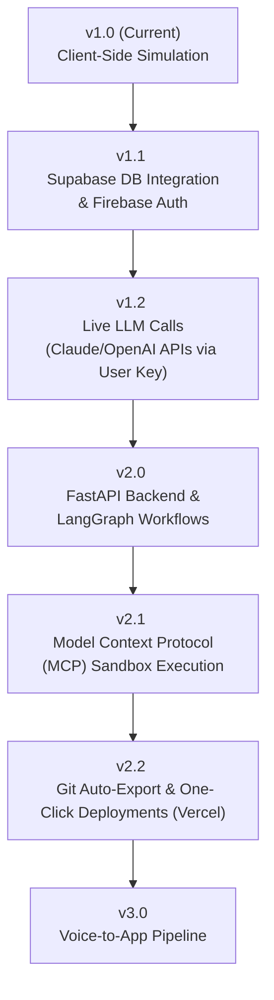

# ⚡ PromithicAI

[](file:///c:/Users/acer/OneDrive/Desktop/Coding/Projects/AI-Web-App-Builder/index.html)
[](file:///c:/Users/acer/OneDrive/Desktop/Coding/Projects/AI-Web-App-Builder/LICENSE)
[](file:///c:/Users/acer/OneDrive/Desktop/Coding/Projects/AI-Web-App-Builder/index.html)

An interactive, premium web console simulating a **Multi-Agent AI Pipeline** that transforms natural language prompts into working, single-page web applications. Drawing inspiration from industry leaders like *Lovable.dev*, *Emergent*, and *v0.dev*, this codebase presents a client-side environment for orchestrating code planning, compilation, verification, and sandboxed execution.

---

## 📖 About the Project

The **PromithicAI** is a serverless, front-end heavy development console. When a user input is received (e.g., *"Build me a Pomodoro timer"*), the system initiates a structured multi-agent loop:

```
[User Prompt] ──> 👤 Planner Agent ──> 👤 Coder Agent ──> 👤 Reviewer Agent ──> 🖥️ Sandbox Preview
```

The app features full code streaming, live sandboxed previews, theme toggles, and localized compilation history, making it both an educational workspace and a framework for AI agent developers.

---

## 🎯 What it Solves

1. **High-Fidelity AI Orchestration Visualization:** It demonstrates how complex multi-agent pipelines (Planner → Coder → Reviewer) communicate state and hand off tasks asynchronously.
2. **Zero-Setup Prototyping:** Allows developers and designers to test interactive widget layouts instantly, completely inside the browser.
3. **No-Dependency Code Editing:** Integrates the full VS Code Monaco editor directly via CDN, offering instant linting and syntax highlighting without massive `node_modules` configurations.
4. **Immediate Exportability:** Renders applications into sandboxed previews, providing single-click options to copy the clean HTML or download a production-ready `.html` file that runs offline.

---

## 🛠️ Technical Challenges & Problems Faced

Building a stateful agent system purely on the client-side using Vanilla JavaScript brought several complex implementation challenges:

*   **Concurrency & Stream Cancellation:**
    Handling stateful, asynchronous streaming loops inside the single-thread model of a browser meant that if a user canceled a build or submitted a new prompt mid-generation, overlapping text streams could corrupt the editor model. This was solved in [js/streaming.js](file:///c:/Users/acer/OneDrive/Desktop/Coding/Projects/AI-Web-App-Builder/js/streaming.js) and [js/agent.js](file:///c:/Users/acer/OneDrive/Desktop/Coding/Projects/AI-Web-App-Builder/js/agent.js) by implementing cancelable promise wrappers and an explicit external abort polling system (`getAbort()`).
*   **Resilient Monaco CDN Integration:**
    Embedding a heavyweight code editor requires robust script loading. If the CDN load of Monaco fails (e.g., offline usage or blocked domains), the app's core feature breaks. To address this, [js/editor.js](file:///c:/Users/acer/OneDrive/Desktop/Coding/Projects/AI-Web-App-Builder/js/editor.js) implements a self-healing fallback mechanism that automatically constructs a lightweight, customized `textarea` replicating Monaco's editor interfaces (`getValue`, `setValue`, `appendCode`) to ensure zero-downtime operation.
*   **Secure Sandboxing of Generated Code:**
    Injecting arbitrary Javascript and CSS from AI outputs into the parent page's DOM would corrupt global styles, leak local storage credentials, and create cross-site script clashes. To guarantee safe execution, generated apps are injected dynamically using the `srcdoc` property of an `<iframe>` configured with a strict `sandbox="allow-scripts"` directive, completely isolating the generated workspace.
*   **Storage Boundaries:**
    Managing local history (up to 30 past builds containing full source code and prompts) in local storage pushes the limits of the browser's standard 5MB limit. Compact JSON serialization rules and try-catch storage managers in [js/history.js](file:///c:/Users/acer/OneDrive/Desktop/Coding/Projects/AI-Web-App-Builder/js/history.js) were created to prevent site crashes and handle storage quota exceptions gracefully.
*   **Grid Layouts without UI Libraries:**
    Structuring an IDE style interface (adjustable columns, sliding history drawers, terminal console logs, iframe previews, and modal popups) while maintaining a premium glassmorphic appearance required complex CSS variables and media query orchestration in [css/builder.css](file:///c:/Users/acer/OneDrive/Desktop/Coding/Projects/AI-Web-App-Builder/css/builder.css) and [css/components.css](file:///c:/Users/acer/OneDrive/Desktop/Coding/Projects/AI-Web-App-Builder/css/components.css) without relying on Tailwind or Bootstrap.

---

## ✨ Features & Core Components

| Component | Description | Reference |
| :--- | :--- | :--- |
| **Multi-Agent Pipeline** | Simulates step-by-step progress logging for Planner, Coder, and Reviewer. | [js/agent.js](file:///c:/Users/acer/OneDrive/Desktop/Coding/Projects/AI-Web-App-Builder/js/agent.js) |
| **Monaco Editor** | Embedded Monaco instance supporting code syntax, layout resizing, and font scaling. | [js/editor.js](file:///c:/Users/acer/OneDrive/Desktop/Coding/Projects/AI-Web-App-Builder/js/editor.js) |
| **History Sidebar** | Local history drawer containing the last 30 builds with quick reload and delete options. | [js/history.js](file:///c:/Users/acer/OneDrive/Desktop/Coding/Projects/AI-Web-App-Builder/js/history.js) |
| **Theme Engine** | Light/dark mode controller synchronizing the page styles and Monaco theme instantly. | [js/theme.js](file:///c:/Users/acer/OneDrive/Desktop/Coding/Projects/AI-Web-App-Builder/js/theme.js) |
| **Agnostic Settings** | Form controls to configure LLM providers, store custom API keys, and tweak font settings. | [js/settings.js](file:///c:/Users/acer/OneDrive/Desktop/Coding/Projects/AI-Web-App-Builder/js/settings.js) |
| **Faded Transition Router** | Animates page transitions smoothly by fading out page wrappers before navigation. | [js/router.js](file:///c:/Users/acer/OneDrive/Desktop/Coding/Projects/AI-Web-App-Builder/js/router.js) |

---

## 🗂️ Project Structure

The project has a modular, clean structure divided between view layouts, custom stylesheets, and utility scripts:

```
AI-Web-App-Builder/
├── index.html                 # Main Landing Page with features, process & roadmap
├── builder.html               # Main Workspace Console (Prompter, Monaco Editor & Live Preview)
├── settings.html              # Configuration center for API keys, themes & editor layout
├── login.html                 # Login page (mock layout)
├── signup.html                # Signup page (mock layout)
├── LICENSE                    # MIT License open source file
├── .gitignore                 # Version control exclusions
├── css/                       # Theme styling system
│   ├── base.css               # Reset styles, container utilities & generic elements
│   ├── variables.css          # Core design tokens, gradients & color variables
│   ├── animations.css         # Keyframes, fade-ins, status pulses & slide-ins
│   ├── components.css         # Buttons, badges, cards, inputs, tabs & toast styles
│   ├── landing.css            # Styles specific to the hero sections of index.html
│   ├── builder.css            # Layout stylesheet for the Monaco workspace split columns
│   ├── settings.css           # Navigation layouts & provider cards for configuration
│   └── auth.css               # Centered card layouts for login/signup panels
└── js/                        # Front-end logic engine
    ├── theme.js               # Applies preferred visual mode and coordinates Monaco styles
    ├── router.js              # Intercepts links to apply smooth page fade-out animations
    ├── settings.js            # Serializes settings state to LocalStorage
    ├── history.js             # Updates sidebar list index and processes selections
    ├── streaming.js           # Implements token typing, log printing & heading typewriter loops
    └── agent.js               # Pipeline orchestrator containing pre-packaged app templates
```

---

## 🗺️ Roadmap & Version Control

### Current Version: `v1.0` (Active)
*   **Regex Prompt Detection:** Identifies 5 target app templates: Pomodoro Timer, Calculator, Todo List, Clock Widget, and Weather Widget.
*   **Simulated Streaming Engine:** Real-time token character streaming to the Monaco editor.
*   **Local compilation History:** LocalStorage sync to save up to 30 custom iterations.
*   **Dual Visual Themes:** Automatic system preference mapping with manual light/dark toggle.
*   **Clean Export Utility:** One-click clipboard copy and `.html` file downloading.

### Upcoming Upgrades



*   **`v1.1` - Cloud Database Sync & Auth:** Integrate Firebase Auth and a Supabase PostgreSQL backend for syncing user profiles and persistent, multi-device history logs.
*   **`v1.2` - Live API Key Generations:** Enable users to store their own Claude or OpenAI API keys in the Settings Panel to query actual live LLM models and stream dynamically generated code.
*   **`v2.0` - Python Backend (FastAPI + LangGraph):** Migrate from client-side simulation to a production-ready Python FastAPI server utilizing LangGraph for structured agent state machine loops.
*   **`v2.1` - MCP Sandbox Execution:** Implement Model Context Protocol (MCP) servers to allow the AI to test code, check console errors, and read/write file systems in isolated containers.
*   **`v2.2` - Git Push & Auto-Deploy:** Add button features to export code directly to GitHub repositories and deploy immediately to Vercel or Netlify.
*   **`v3.0` - Voice-to-App Interface:** Integrate real-time voice recognition pipelines to build applications directly through spoken instructions.

---

## 🚀 Quick Start

1. Clone or download this repository locally:
   ```bash
   git clone https://github.com/your-username/AI-Web-App-Builder.git
   ```
2. Simply double-click [index.html](file:///c:/Users/acer/OneDrive/Desktop/Coding/Projects/AI-Web-App-Builder/index.html) to open the landing page in your browser.
3. For a fully responsive, smooth transition experience, serve the directory using a lightweight HTTP server (such as VS Code's Live Server, or Python's server command):
   ```bash
   python -m http.server 8000
   ```
4. Navigate to `http://localhost:8000` in your web browser.
