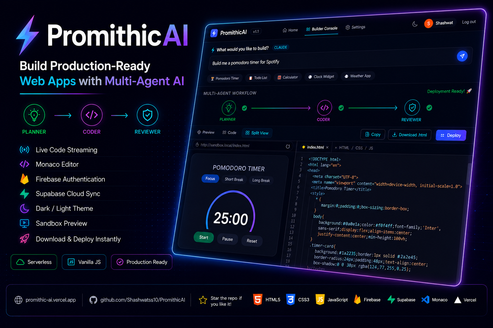

# ⚡ PromithicAI

<p align="center">
  
</p>

<p align="center">


</p>

<p align="center">
AI-Powered Web Application Builder inspired by modern AI development platforms.
</p>

<p align="center">
Planner ➔ Coder ➔ Reviewer
</p>

<p align="center">
<a href="https://promithic-ai.vercel.app">🚀 Try PromithicAI</a> | 
<a href="https://github.com/Shashwatss10/PromithicAI">💻 GitHub</a>
</p>

---

## ✨ Features

| Feature | Description |
|---------|-------------|
| 🤖 Multi-Agent Workflow | Planner ➔ Coder ➔ Reviewer pipeline |
| ⚡ Live Code Streaming | Real-time AI generation simulation |
| 📝 Monaco Editor | VS Code-like editing experience |
| 🔐 Firebase Authentication | Email & Google Sign-in |
| ☁️ Supabase Sync | Cross-device project history |
| 🌓 Dark / Light Theme | Persistent theme switching |
| 🖥️ Live Sandbox Preview | Execute generated apps safely |
| 📥 HTML Export | Download production-ready HTML |
| 🚀 One-click Deployment | Deploy generated applications |
| 📱 Responsive Design | Desktop & mobile optimized |

---

## 🛠️ Tech Stack

| Category | Technology |
|----------|------------|
| Frontend | HTML5, CSS3, Vanilla JavaScript (ES6) |
| Editor | Monaco Editor (VS Code core) via CDN |
| Authentication | Firebase Auth (Email/Password, Google OAuth) |
| Database | Supabase PostgreSQL REST API |
| Deployment | Vercel, GitHub Actions |
| Architecture | Multi-Agent Pipeline Simulation |
| Styling | CSS Variables, Glassmorphism, Custom Animations (`fx.css`) |

---

## 📂 Project Structure

```text
PromithicAI/
├── assets/               # Images and branding assets
├── backend/              # Python FastAPI & LangGraph Orchestration
│   ├── main.py           # FastAPI Application Entry Point
│   ├── Procfile          # Deployment Instructions (Heroku/Render)
│   ├── requirements.txt  # Python Dependencies 
│   ├── .env.example      # Environment variables template
│   │
│   ├── agents/           # LangGraph Nodes & State Graph
│   │   ├── graph.py      # Core LangGraph orchestration flow
│   │   ├── planner.py    # Architecture & Requirements logic
│   │   ├── coder.py      # Code generation logic
│   │   └── reviewer.py   # Code verification logic
│   │
│   ├── api/              # FastAPI Routes & Endpoints
│   ├── middleware/       # Security & Interceptors
│   ├── models/           # Pydantic Schemas & State Types
│   └── providers/        # LLM Integrations (Factory Pattern)
│
├── css/                  # Styling Architecture (polish, animations, etc.)
├── js/                   # Client-Side Logic (Firebase, Editor, UI FX)
├── screenshots/          # Project screenshots for documentation
│
├── .gitignore            # Version Control Filters
├── builder.html          # Main IDE Console Workspace
├── index.html            # Marketing / Landing Page
├── LICENSE               # MIT License
├── login.html            # Firebase Authentication Flow
├── README.md             # Project Specification
├── settings.html         # API Configuration & Engine State
├── signup.html           # User Onboarding & Signup Flow
└── vercel.json           # Vercel Frontend Deployment Config
```

### Workflow Overview

1. **Planner Agent** analyzes the user's request.
2. **Coder Agent** generates HTML, CSS, and JavaScript.
3. **Reviewer Agent** validates and improves the generated code.
4. The generated code is loaded into the **Monaco Editor**.
5. A secure **Sandbox Preview** renders the application.
6. Users can download or deploy the generated application.

---

## 📖 About the Project

**PromithicAI** is a serverless, front-end-heavy development console. When a user input is received (e.g., *"Build me a Pomodoro timer"*), the system initiates a structured multi-agent loop:

```
[User Prompt] ──> 👤 Planner Agent ──> 👤 Coder Agent ──> 👤 Reviewer Agent ──> 🖥️ Sandbox Preview
```

The app features full code streaming, live sandboxed previews, theme toggles, and cloud-synced compilation history, making it both an educational workspace and a framework for AI agent developers.

---

## 🎯 What it Solves

1. **High-Fidelity AI Orchestration Visualization:** It demonstrates how complex multi-agent pipelines (Planner → Coder → Reviewer) communicate state and hand off tasks asynchronously.
2. **Zero-Setup Prototyping:** Allows developers and designers to test interactive widget layouts instantly, completely inside the browser.
3. **No-Dependency Code Editing:** Integrates the full VS Code Monaco editor directly via CDN, offering instant linting and syntax highlighting without massive `node_modules` configurations.
4. **Immediate Exportability:** Renders applications into sandboxed previews, providing single-click options to copy the clean HTML or download a production-ready `.html` file that runs offline.

---

## 🛠️ Technical Challenges & Problems Faced

Building a stateful agent system purely on the client-side using Vanilla JavaScript brought several complex implementation challenges:

*   **Concurrency & Stream Cancellation:**
    Handling stateful, asynchronous streaming loops inside the single-thread model of a browser meant that if a user canceled a build or submitted a new prompt mid-generation, overlapping text streams could corrupt the editor model. This was solved in `js/streaming.js` and `js/agent.js` by implementing cancelable promise wrappers and an explicit external abort polling system (`getAbort()`).
*   **Resilient Monaco CDN Integration:**
    Embedding a heavyweight code editor requires robust script loading. If the CDN load of Monaco fails (e.g., offline usage or blocked domains), the app's core feature breaks. To address this, `js/editor.js` implements a self-healing fallback mechanism that automatically constructs a lightweight, customized `textarea` replicating Monaco's editor interfaces (`getValue`, `setValue`, `appendCode`) to ensure zero-downtime operation.
*   **Secure Sandboxing of Generated Code:**
    Injecting arbitrary JavaScript and CSS from AI outputs into the parent page's DOM would corrupt global styles, leak local storage credentials, and trigger cross-site scripting conflicts. To ensure safe execution, generated apps are dynamically injected via the `srcdoc` property of an `<iframe>` configured with a strict `sandbox="allow-scripts"` directive, thereby completely isolating the generated workspace.
*   **Hybrid Storage Boundaries:**
    Managing local history (up to 30 past builds containing full source code and prompts) in local storage pushes the limits of the browser's standard 5MB limit. To support multi-device access and persistent storage, we implemented a hybrid cloud sync strategy: local builds write immediately to local storage and queue up for asynchronous replication to Supabase when a user signs in.
*   **Grid Layouts without UI Libraries:**
    Structuring an IDE-style interface (adjustable columns, sliding history drawers, terminal console logs, iframe previews, and modal popups) while maintaining a premium glassmorphic appearance required complex CSS variables and media query orchestration in `css/builder.css` and `css/components.css` without relying on Tailwind or Bootstrap.

---

## 🚀 What's New in v2.0 Release
- **FastAPI & LangGraph Multi-Agent Backend:** Moved the core AI workflow server-side into real stateful agents: Planner ➔ Coder ➔ Reviewer with bounded automatic retry loops.
- **Multi-Provider & Dynamic Model Selection:** Integrated Claude (Anthropic), GPT (OpenAI), and NVIDIA NIM with server-authoritative model validation and dynamic Settings dropdown.
- **Real-time SSE Streaming:** Live token streaming directly from LLMs into Monaco Editor and live preview sandbox.
- **Firebase Auth Gated API & Supabase Persistence:** Verified ID token middleware and automatic database storage of generated applications.
- **Hybrid BYOK & Simulation Fallbacks:** Full client-side fallback resilience if the backend is offline.

---

## 🔮 Upcoming Features (v2.0+)

| Version | Planned Feature | Status |
|:---|:---|:---|
| **v1.2** | Custom API Keys - BYOK (Claude + OpenAI), Connect/Disconnect toggle per provider | ✅ Released |
| **v2.0** | Python FastAPI Backend, LangGraph Multi-Agent Orchestration, NVIDIA NIM, Dynamic Model Selection | ✅ Released |
| **v2.1** | MCP Sandboxed local execution capabilities | *Planned* |
| **v2.2** | Push to GitHub & deploy directly from the IDE | *Planned* |
| **v3.0** | Voice-to-App live streaming | *Planned* |

---

## ⚙️ Deployment Guide

### Step 1: Deploy to Vercel
1. Log in to [Vercel](https://vercel.com) using your GitHub account.
2. Select **"Import Project"** and choose the `PromithicAI` repository.
3. Keep the framework preset as **Other** and the root directory as `./`.
4. Click **Deploy**. Vercel will build the project using the static configuration in `vercel.json` for clean URL routing.

### Step 2: Configure Firebase Authentication
1. Go to the [Firebase Console](https://console.firebase.google.com/).
2. Select your project and navigate to **Authentication** -> **Settings**.
3. Under **Authorized domains**, click **"Add domain"** and add your Vercel deployment URL (e.g., `promithic-ai.vercel.app`).
4. Ensure **Email/Password** and **Google** are enabled under the **Sign-in method** tab.

### Step 3: Set up Supabase Database Schema
Run the following query in the **SQL Editor** of your Supabase dashboard to create the synced builds table:

```sql
CREATE TABLE IF NOT EXISTS public.builds (
  id          TEXT PRIMARY KEY,
  user_id     TEXT NOT NULL,
  prompt      TEXT NOT NULL,
  code        TEXT NOT NULL,
  template    TEXT DEFAULT 'custom',
  provider    TEXT DEFAULT 'claude',
  created_at  TIMESTAMPTZ DEFAULT NOW()
);
CREATE INDEX IF NOT EXISTS idx_builds_user_id ON public.builds(user_id);
CREATE INDEX IF NOT EXISTS idx_builds_created_at ON public.builds(created_at DESC);
ALTER TABLE public.builds DISABLE ROW LEVEL SECURITY;
```

---

## 💖 Support the Project

If you found **PromithicAI** useful or interesting, you can support the project by:

- ⭐ Starring the repository
- 🍴 Forking the repository
- 🐛 Reporting bugs by opening an Issue
- 💡 Suggesting new features or improvements
- 🔗 Sharing the project with fellow developers

Every contribution, suggestion, and star helps make **PromithicAI** better and motivates future development.

I appreciate your support! 🙏

---

## 📜 License

This project is licensed under the **MIT License**.

You are free to use, modify, and distribute this software in accordance with the terms of the license.

See the [LICENSE](LICENSE) file for complete details.

---

## 👨‍💻 Built By

### Shashwat Sharma

Computer Science & Engineering Student

- 🌐 GitHub: https://github.com/Shashwatss10
- 🔗 Live Demo: https://promithic-ai.vercel.app/

Made with ❤️ using **HTML, CSS, JavaScript, Firebase, Supabase & Monaco Editor**.
